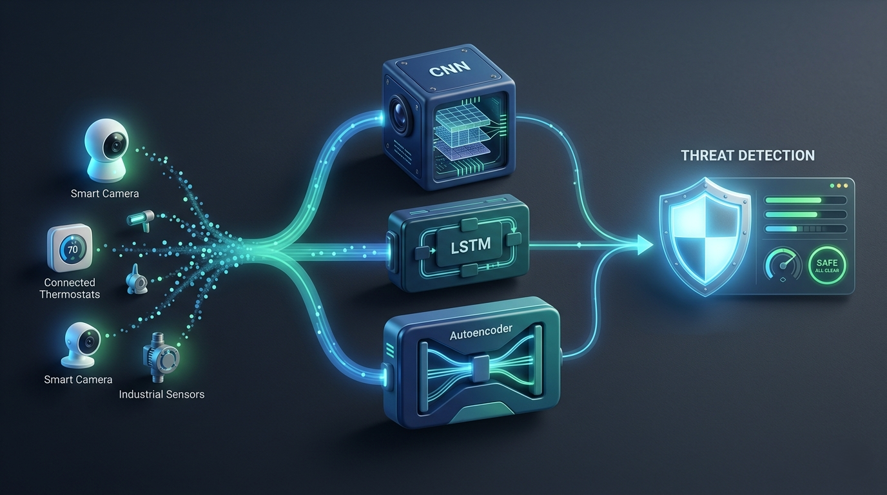

<div align="center">

<h1>IoT Cybersecurity — Hybrid ML/DL Models</h1>

<p><strong>Building intrusion detection that actually works at IoT scale.</strong></p>

<p><em>“75 billion IoT devices. Most are unsecured. That’s a civilizational risk.”</em></p>

<br/>


<br/><br/>
</div>

## The Problem

IoT networks are noisy, heterogeneous, and permanently online. Devices ship with weak defaults, inconsistent firmware, and almost no built‑in security. Signature-based intrusion detection and static rules collapse under this volume and variability.

This paper proposes a defence stack designed for that reality, not for idealized lab conditions.

<div align="center">
<br/>

<br/><br/>
</div>

## What’s Inside

- **CNN** – captures spatial attack patterns in flow features and payload structure.  
- **LSTM** – models temporal dependencies and slow, multi‑stage campaigns.  
- **Autoencoders** – surface anomalies without needing labeled attack data.  
- **Tree models (Random Forest, XGBoost)** – strong baselines and ensembles.  
- **Federated learning** – trains across many devices without centralizing raw logs.  
- **Edge deployment** – runs on gateways and constrained nodes, not just in the cloud.

## Key Results

<div align="center">
<br/>

<br/><br/>
</div>

- Detection accuracy above **99%** on **UNSW‑NB15** and **NSL‑KDD**.  
- **F1 ≥ 0.97** across DDoS, brute‑force, and web attack classes.  
- Zero‑day behaviours flagged via anomaly components without prior signatures.

## Tech Stack

```text
Modeling:    CNN · LSTM · Autoencoders · Random Forest · XGBoost
Tooling:     Python · PyTorch/TensorFlow · Scikit‑learn
Paper:       LaTeX · TikZ for architecture and result diagrams
Deployment:  Edge gateways, IoT devices, on‑prem inference servers
```

## Why This Matters

The best security system is one that learns faster than the attacker.  
This work moves IoT defence toward that standard.

---

<div align="center">

<a href="https://github.com/jeswinbenedict">
  
</a>

</div>
